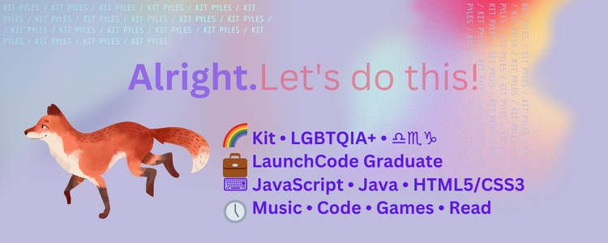

  

### 🔭 I’m currently working on:
* Collaborative project: A patient-centric universal health record ([Health eHub](https://github.com/Jan-23-Liftoff-KC/team-hyunsu-group-repo))
* Solo Project: A persistent MVC with MySQL refactor of a [previous HTML project](https://github.com/KC-LC101-June-22/js-assignment-4-html-me-something-KitPyles) ([Grimoire Refactor MVC](https://github.com/KitPyles/Grimoire-refactor-MVC))

### 😄 My Pronouns: Fae/Faem

###  My Links:

### My Tech Stack:
* Cloud Services: 

* Languages: 

* Frameworks: 

* Databases: 

* Programs & Tools: 

### My Education:
* LaunchCode LC101: JavaScript & Java
* 
* 
* 

### My Stats:

